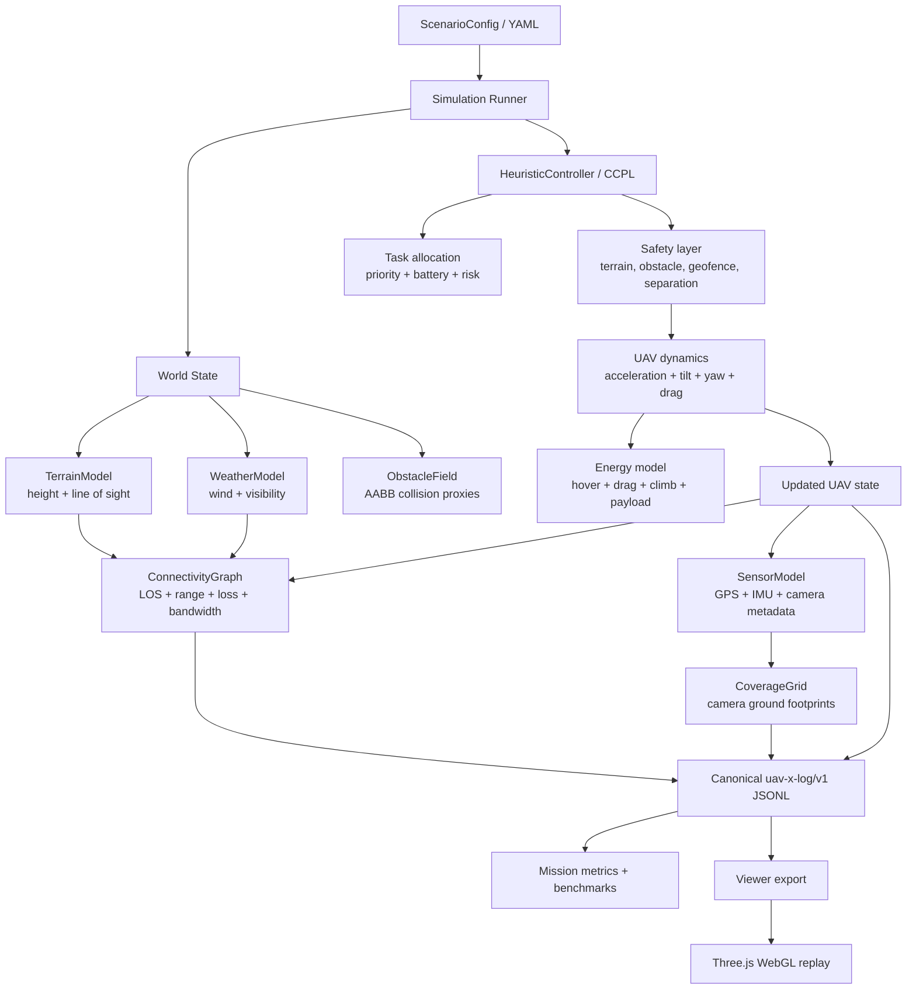
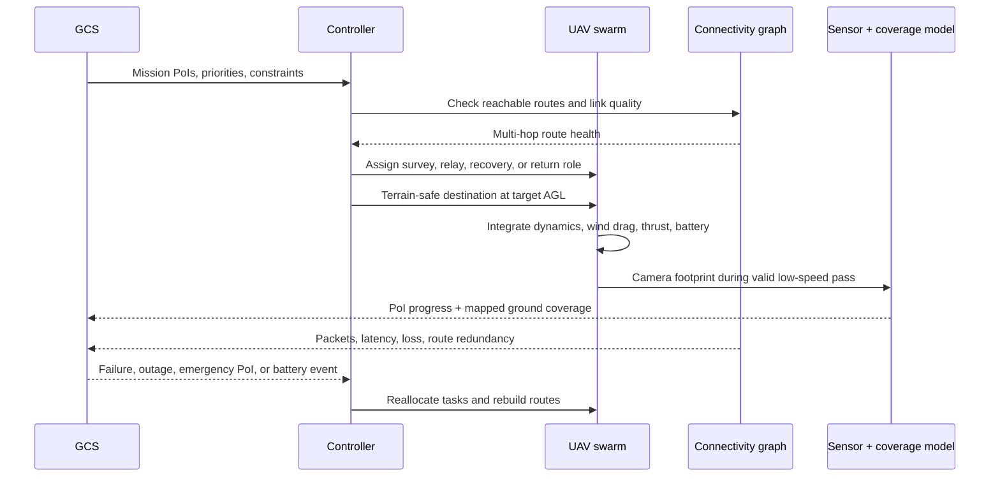
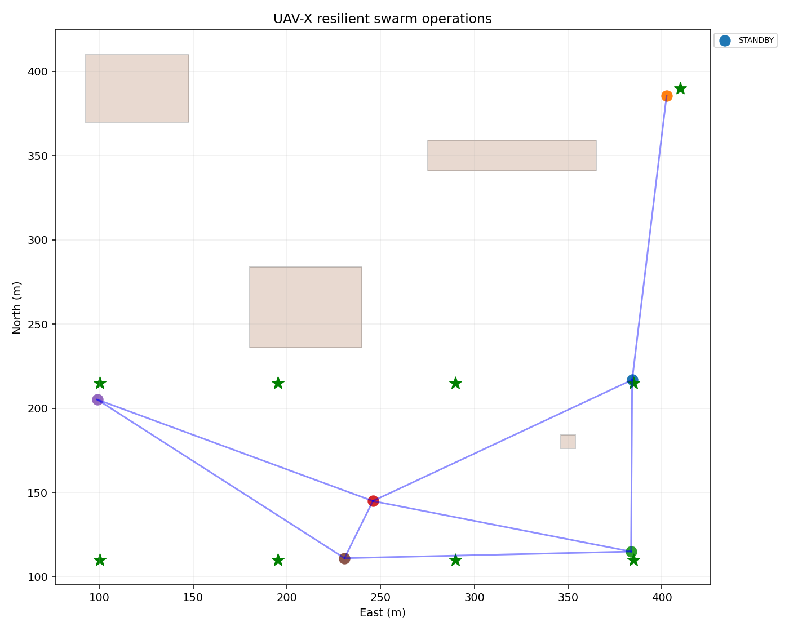

# UAV-X — Resilient BVLOS Swarm

UAV-X is a deterministic Python proof-of-concept for a disaster-response UAV
swarm. It demonstrates autonomous survey allocation, terrain-aware flight,
resilient BVLOS communication, relay reassignment, safety overrides, battery
reserve handling, UAV failure recovery, and replay visualization.

The simulator is the authoritative source of mission state. The viewer only
renders the exported replay; it does not invent UAV positions, routes, events,
or metrics.

## What the system does

1. Creates a GCS, UAV fleet, terrain, obstacles, weather, and disaster PoIs.
2. Assigns survey tasks using priority, distance, battery, risk, and connectivity.
3. Moves UAVs with bounded acceleration, tilt, yaw, wind drag, thrust, and energy use.
4. Maintains multi-hop routes through a resilient connectivity graph.
5. Uses terrain and obstacle prediction before movement and a post-dynamics safety shield.
6. Surveys PoIs using camera FOV, ground footprint, altitude-above-ground, speed, and dwell time.
7. Tracks mapped ground area on a lightweight coverage grid.
8. Exports a canonical JSONL log for metrics, 2D plots, and the WebGL replay viewer.

## Architecture



## Mission and survey flow



## Coordinate system and physics

The simulator uses ENU-style coordinates:

- `x`: east, metres
- `y`: north, metres
- `z`: altitude, metres

Terrain elevation is sampled from `viewer/public/scene/terrain_heightmap.json`.
Survey destinations are generated at `terrain_height + survey_altitude_agl_m`.
The flight model is intentionally lightweight, but includes bounded acceleration,
maximum speed, climb rate, tilt and yaw limits, air-relative quadratic drag,
payload-dependent hover power, climb power, and forward-flight parasite power.

Survey completion is separate from area mapping. A PoI progresses only when the
camera footprint contains it, the UAV is within a safe AGL range, the UAV is
moving slowly enough to image the target, and the required dwell time has elapsed.
The `CoverageGrid` records the larger ground area mapped by the camera.

## Quick start

```powershell
python -m pip install -r requirements.txt
python -m uav_x.simulation.runner --seed 7 --duration 2700 --out runs\uav_x_run.jsonl
python -m uav_x.visualization.operations_2d runs\uav_x_run.jsonl
python -m uav_x.validation --duration 2700 --out reports\validation.json
```

Run tests:

```powershell
python -m pip install -r requirements-dev.txt
python -m pytest -q
```

The regression suite covers physics, scenarios, obstacles, sensing,
connectivity, metrics, and survey coverage.

## Scenarios and benchmarks

Challenge-facing scenarios are in `scenarios/`:

- `baseline.yaml`
- `emergency_priority.yaml`
- `outage_recovery.yaml`
- `return_home_recharge.yaml`
- `uav_failure.yaml`
- `simultaneous_failure_outage.yaml`

Run the complete benchmark suite:

```powershell
python -m uav_x.benchmarks --all --duration 2700 --out reports\stage1_benchmark.json
```

### Enhanced low-latency relay-backbone profile

The official baseline preserves the challenge figure's six-UAV, 100 m-radio
assumptions and therefore exposes ferry latency for far PoIs. For an engineered
low-latency deployment, run the separate relay-backbone profile:

```powershell
py -3.11 -m uav_x.simulation.runner `
  --scenario scenarios\relay_backbone.yaml `
  --policy heuristic `
  --out runs\relay_backbone.jsonl
```

This profile uses 15 UAVs: six survey vehicles and nine station-keeping relay
vehicles arranged as a 3×3 lattice. It uses a 400 m radio profile and powered
relay pads, so the assumptions differ from the official 100 m baseline. The
full 2700-second run completes all 10 PoIs with zero report-deadline violations,
zero collisions, and all 15 vehicles landed on their designated pads.

The report includes mission completion, connectivity availability, packet
delivery, report latency, landing roll-call, recovery, collision, battery, geofence, and obstacle metrics.

For long or streamed runs:

```powershell
py -3.11 -m uav_x.simulation.runner --duration 2700 --stream --out runs\streamed.jsonl
```

## WebGL replay viewer

```powershell
py -3.11 -m uav_x.interfaces.viewer_export runs\uav_x_run.jsonl --out runs\replay.json
cd viewer
npm install
npm run dev
```

Open the local Vite URL and load `runs/replay.json` using **Replay → Choose
File**. The viewer includes mission story, UAV roles, route links, event alerts,
terrain, obstacles, camera markers, replay speed, seek control, and graphics
quality presets.

For an 8 GB RAM machine, keep **Auto** or **Low** quality selected. The default
scene uses compact textured terrain. Optional terrain tiles can be tested with:

```text
http://localhost:5173/?tiles=1
```

Regenerate the Blender-free lightweight terrain tiles:

```powershell
py -3.11 tools\build_realistic_scene.py
```

The repository avoids requiring Blender or large photogrammetry datasets.
Runtime assets are bounded, use low/medium/high detail levels, and share
obstacle metadata with the simulator.

## Optional CCPL policy

The default `auto` policy uses standalone CCPL when installed and records an
explicit heuristic fallback otherwise. To require CCPL:

```powershell
python -m pip install -r requirements-ccpl.txt
python -m uav_x.train_ccpl --episodes 25
python -m uav_x.simulation.runner --policy ccpl --checkpoint checkpoints\uav_x_ccpl.pkl
```

Hard safety constraints remain deterministic and outside the learned policy.

## Repository map

```text
uav_x/core/             Models, dynamics, terrain, connectivity, allocation
uav_x/simulation/       Runner, sensors, disturbances, coverage grid
uav_x/metrics/          Mission and safety metrics
uav_x/interfaces/       JSONL schema, streaming, viewer export
uav_x/visualization/    Matplotlib 2D/3D and operations views
viewer/                 Three.js replay application
scene/                  Terrain and obstacle source metadata
scenarios/              Reproducible challenge scenarios
tests/                  Regression and behavior tests
tools/                  Blender-free scene generation utilities
docs/                   Reproducibility and technical documentation
```

## Reproducibility

Runs are deterministic for a fixed seed and configuration. The canonical log
records the seed, configuration hash, per-tick UAV/PoI/link state, weather,
events, survey coverage, and final metrics. The Python simulator and JSONL log
are the authoritative reproducibility path; MATLAB support is optional.

The separate Stage 1 technical proposal and demonstration video are submission
artifacts and are not generated automatically by this repository.

## MATLAB 3D mission scene

The repository also includes a MATLAB-native 3D replay with lightweight
hexacopters, terrain, obstacles, GCS, survey assignments, relay links, camera
footprints, and mission coverage. It reads the same canonical JSONL log used by
the Python and WebGL viewers:

```matlab
cd('C:\Users\kumar\OneDrive\Desktop\UAV_X');
addpath('matlab');

uav_x_3d_replay('runs\submission_demo.jsonl', ...
    'artifacts\matlab_uavx_3d.gif');

uav_x_3d_replay('runs\submission_demo.jsonl', ...
    'artifacts\matlab_uavx_3d.mp4');

uav_x_overview('runs\submission_demo.jsonl', ...
    'artifacts\matlab_uavx_overview.png');
```

This is a MATLAB-native visualization/replay scene. Actual Gazebo co-simulation
requires an external Gazebo/ROS installation and Robotics System Toolbox; it is
not embedded inside MATLAB.

## One-command Stage 1 evidence package

Run the complete evidence pipeline from the repository root:

```powershell
python tools\run_stage1.py
```

This runs the full test suite, the 2700-second (45-minute) benchmark and validation reports,
randomized hidden-disturbance evaluation, controlled ablations, a combined
failure/outage canonical log, browser replay export, and the judge-facing
failure/recovery video. When MATLAB is available, the pipeline uses the
MATLAB-native `VideoWriter` renderer; otherwise it uses the portable fallback
GIF. Outputs are written to `reports/`, `runs/`, `artifacts/`,
and `logs/`; the package index is
`reports/stage1_package_summary.json`. On memory-constrained machines, cap
numerical threading first:

```powershell
$env:OPENBLAS_NUM_THREADS='1'; $env:OMP_NUM_THREADS='1'; $env:MPLBACKEND='Agg'
python tools\run_stage1.py
```

To invoke the MATLAB renderer directly from Python:

```powershell
python tools\run_matlab_video.py runs\stage1_failure_recovery.jsonl `
    --out artifacts\stage1_failure_recovery_matlab.mp4
```

The bridge first uses the official MATLAB Engine API for Python when it is
installed, then falls back to `matlab.exe -batch`. Install the Engine API from
the MATLAB installation (`extern\engines\python`) if you want Python to keep
the MATLAB session in-process. MATLAB still owns the scene and `VideoWriter`;
Python only supplies the canonical log and output path.

## Generated submission artifacts

The current generated figures and replays are stored in [`artifacts/`](artifacts/).
They are produced from the 2700-second mission-scale canonical logs
(`runs/baseline2700.jsonl`, `runs/stage1_failure_recovery.jsonl`).

### Baseline operations view (1000 m arena, GCS at operational center)



### Failure/recovery operations view


### Failure/recovery replay

[`artifacts/stage1_failure_recovery.gif`](artifacts/stage1_failure_recovery.gif)
(90 frames, stride 30 over the 2700 s log).

### Full demonstration video

[`artifacts/stage1_full_demo.mp4`](artifacts/stage1_full_demo.mp4)
(~16 s, 1280×720: operations stills + failure/recovery reel).

To regenerate the Python artifacts:

```powershell
py -3.11 -m uav_x.visualization.operations_2d `
    runs\baseline2700.jsonl `
    --out artifacts\operations_2d.png

py -3.11 tools\build_stage1_video.py `
    runs\stage1_failure_recovery.jsonl `
    --out artifacts\stage1_failure_recovery.gif `
    --stride 30 --fps 12
```

MATLAB scripts in `matlab/` consume the same frozen logs; MATLAB figures are
regenerated on demand via the commands in the
[MATLAB 3D mission scene](#matlab-3d-mission-scene) section and are not
checked in as stale exports.
